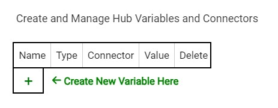
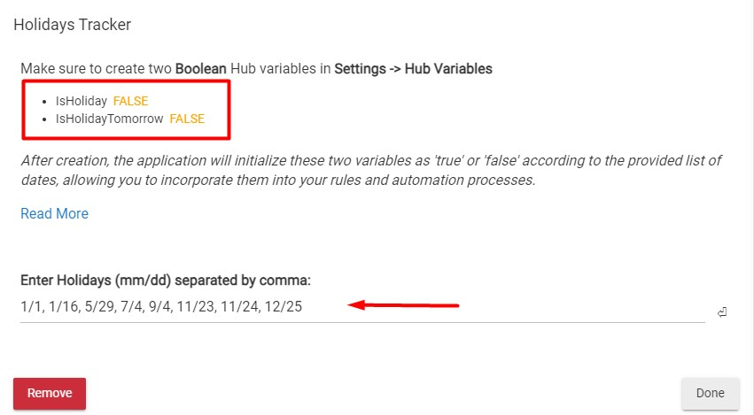

# Holidays App

Introducing a Custom Hubitat Application designed to monitor holidays.

Simply supply a list of holidays in the format `mm/dd`, such as `12/25` for Christmas.

The application will then configure two Hub variables, named `IsHoliday` and `IsHolidayTomorrow`, based on the current date and the provided list of dates.

Use these variables within your rule configurations for enhanced automation.

Example Use Cases:

- Don't heat my office if today it's a holiday.
- Don't tell me to take the trash out if tomorrow is a holiday.

# Install

### Create two hub variables

1. Go to your hub and then `Settings` and `Hub Variables`

2. Click on `+` to add a new variable



3. Add IsHoliday:

- Name the hub variable: `IsHoliday`
- Variable Type: `Boolean`
- Set initial value: `false`

4. Add IsHolidayTomorrow:

- Name the hub variable: `IsHolidayTomorrow`
- Variable Type: `Boolean`
- Set initial value: `false`

It should looks like this:


> Make sure you use that exact same names, case sensitive and no spaces.

### Install App

1. Go to your hub and then click on `Apps code` (left menu, inside Developers tools)

2. Click on `+ New app` (top right corner)


3. Copy & paste the code located in `app.groovy` then click `Save`

4. Go to `Apps` (left menu) and then click `+ Add user app` (top right corner) and select `Holidays App`


# Usage

Once in the app verify the two variables are in `OK` state. This means they've been created with the right name and type.

Enter the list of holidays in thr format mm/dd separated by comma.

Example:

```
1/1, 1/16, 5/29, 7/4, 9/4, 11/23, 11/24, 12/25
```



Finally click `Done`

Every morning at (12:01) the app will run, and set up those two variables either true or false.

## Scheduler Validation

To validate the app is scheduled properly:


It should be scheduled to run every day at 12:01 AM
